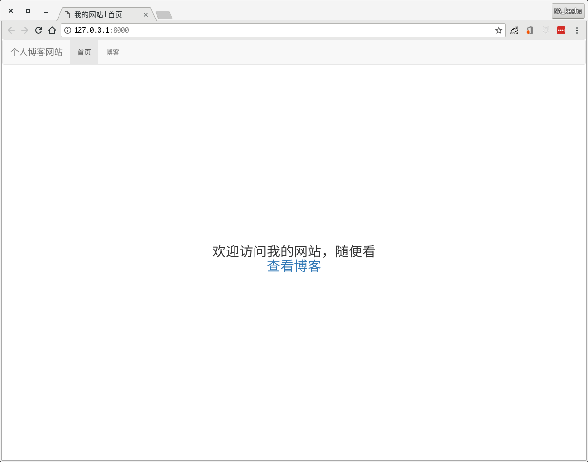
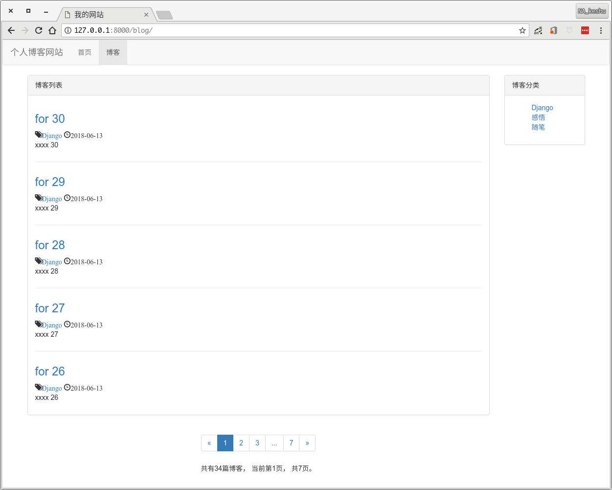
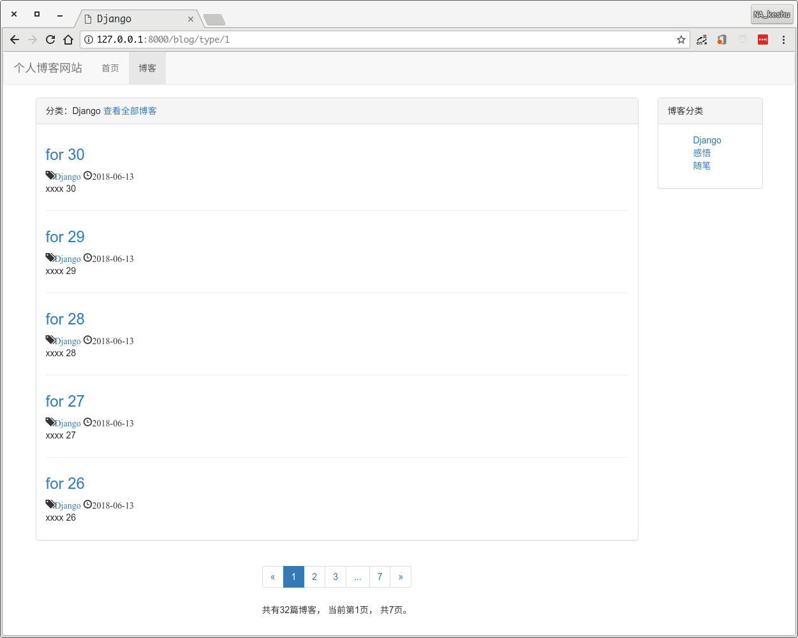
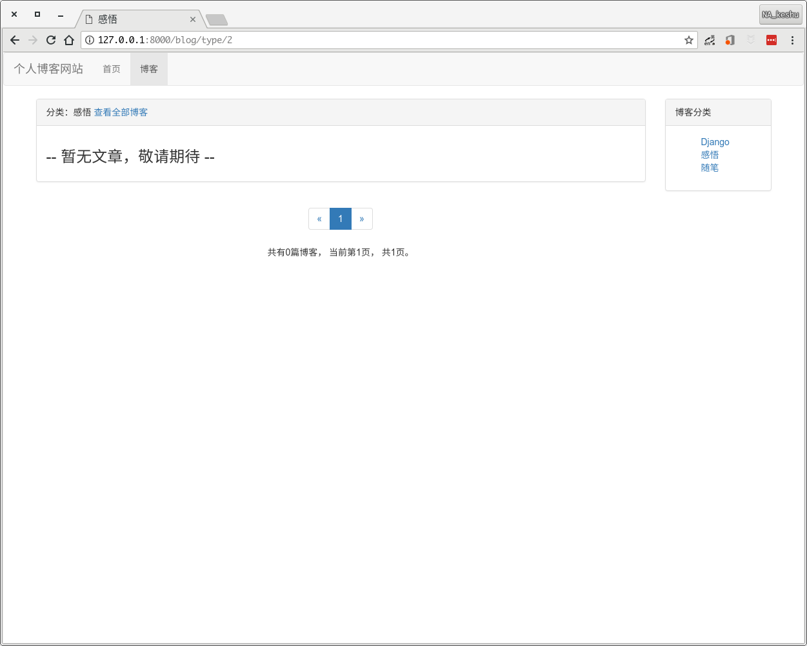
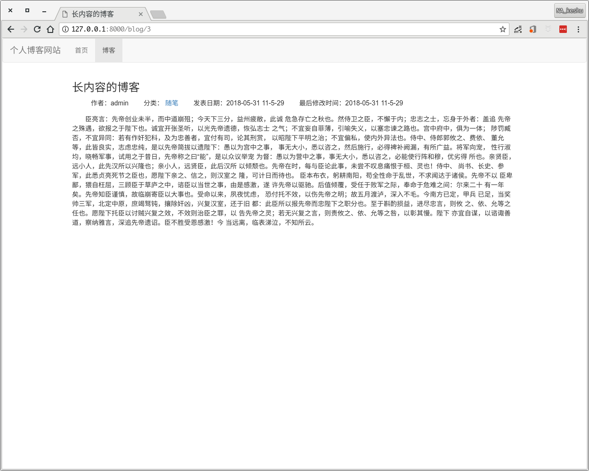

简易个人博客
===

### **这个项目是跟着[BILIBILI上杨仕航老师的django教程](http://space.bilibili.com/252028233/#/channel/detail?cid=28138)一步一步打下来的，完全不原创**

### **非常感谢杨老师的视频教程！教程通俗易懂，由浅入深，非常有实用性，推荐想入坑django的小伙伴去B站看一看。**

### **关于这个教程的更详细代码可以在[杨老师的github](https://github.com/HaddyYang/django2.0-course)上找到**

### **更多相关内容可以参考[杨老师的博客](http://yshblog.com/)**

-------

#### 简介

语言：python3  
框架：django2.0、bootstrap、jQuery  
数据库：MySQL（可以改设置，使用其它数据库）  
在学习django的过程中，跟着教程写下来的博客。  
如果您觉得好或者也想学习django，可以去B站看一下那个教程。

#### 图示

首页

博客列表

博客分类列表

博客详情

**随着学习的深入，还会不断更新修改这个项目，TO BE CONTINUE**